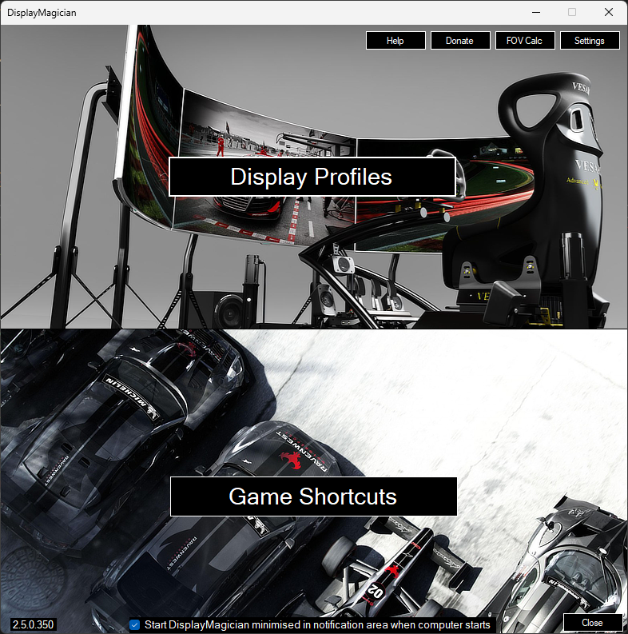
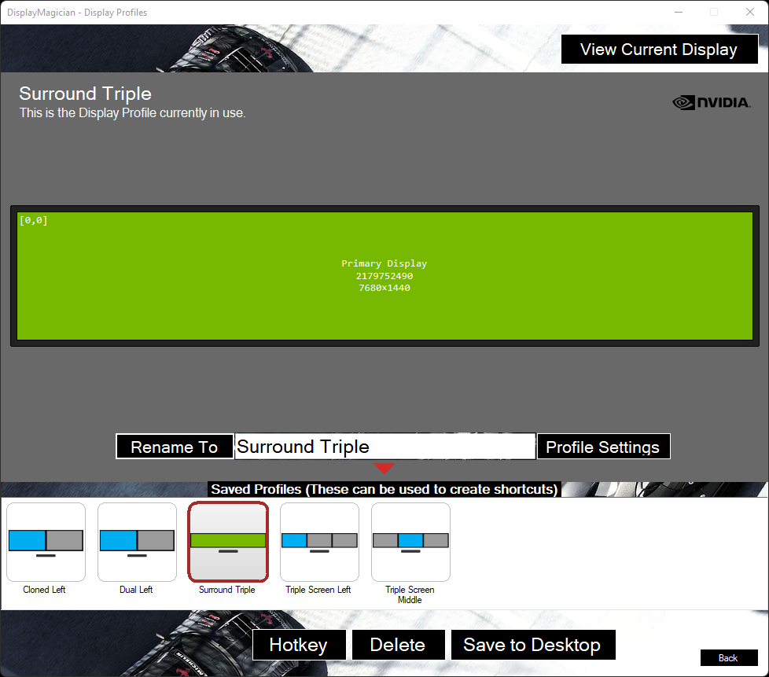
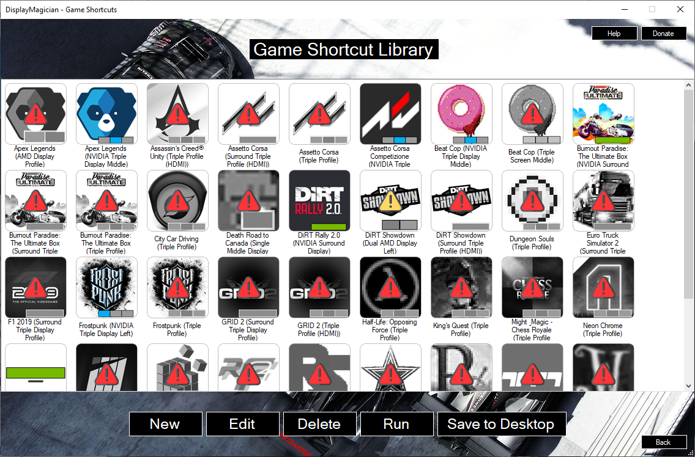
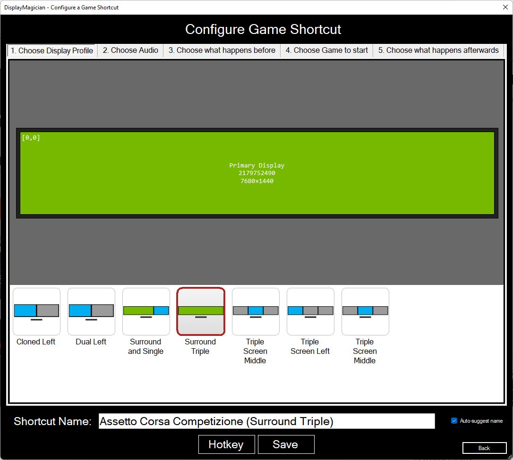
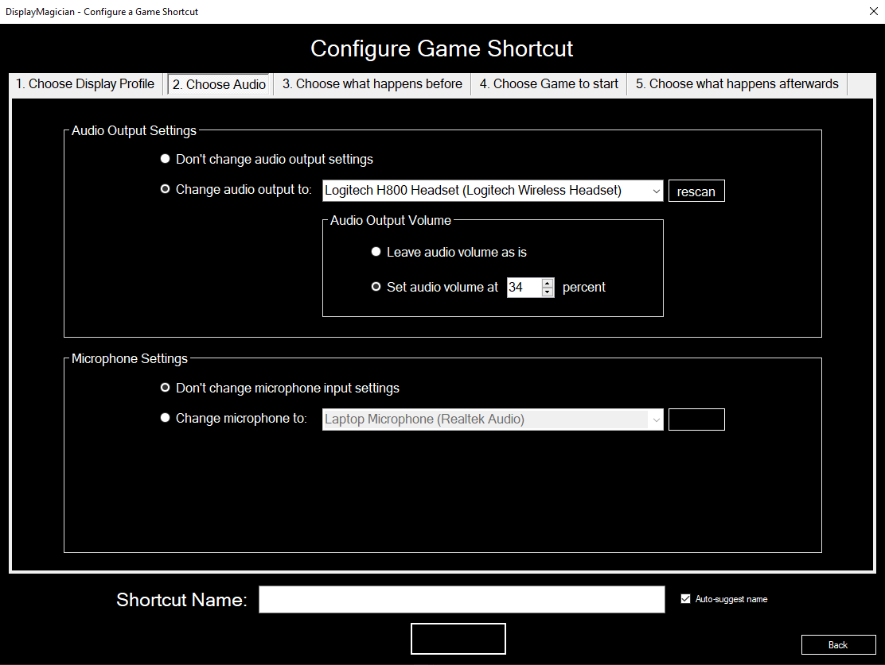
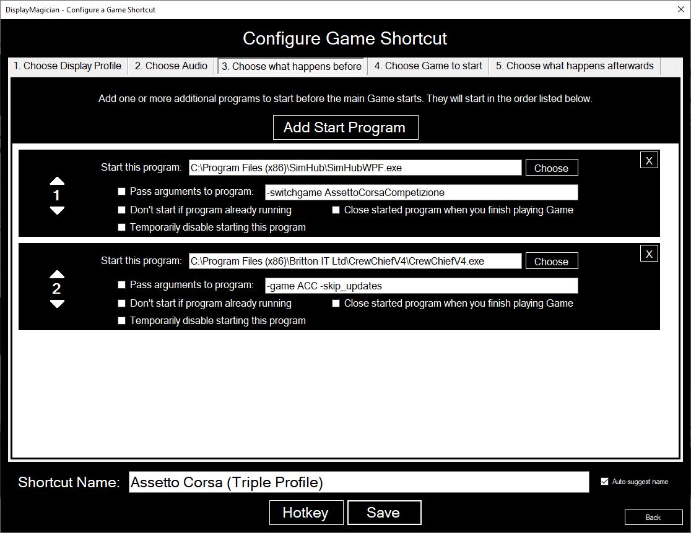
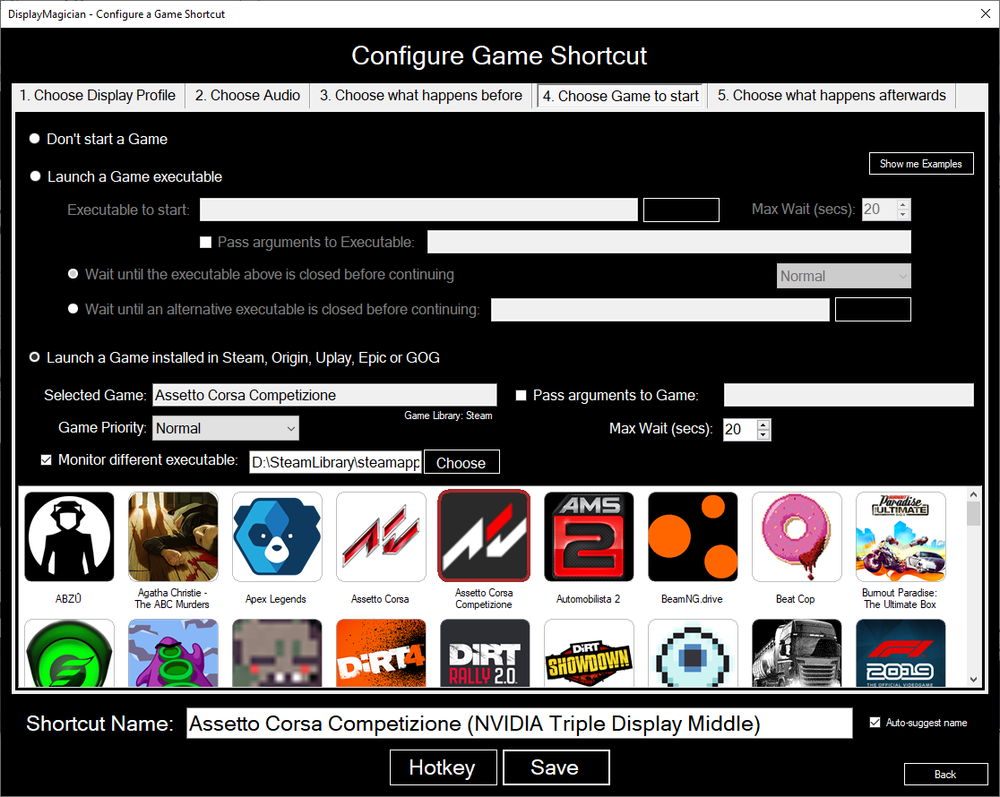
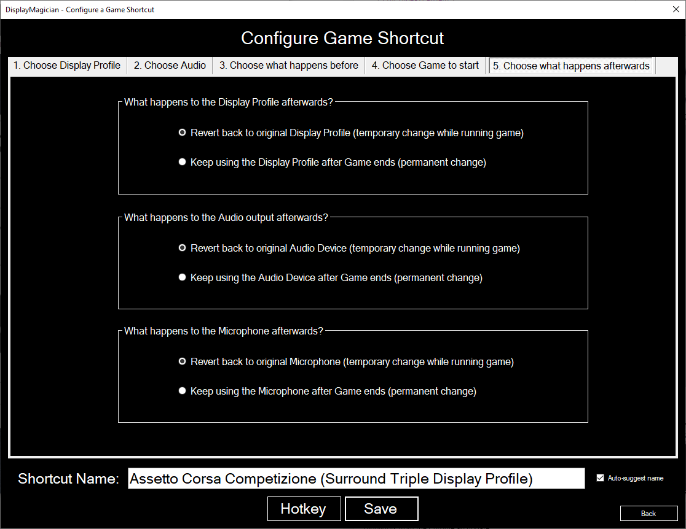
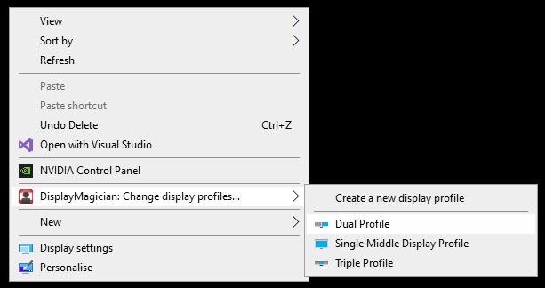
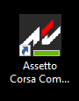

# DisplayMagician

DisplayMagician is an open source tool for automatically configuring your displays for a game or application from a single Windows Shortcut. DisplayMagician is designed to change your display profile, start extra programs and then run the game or application you want. It will even reset things back to the way they were for you once you've closed the game or application!

**This program is based on the original HeliosDisplayManagement software created by Soroush Falahati!**

## Download

The latest version of this application is available for download via the [release](https://github.com/terrymacdonald/DisplayMagician/releases) page.

## What it does

Different games require your displays configured in different ways. If you're a simracer like me, you also require a lot of additional 'helper' applications the give you the additional functionality to game the way you want. Making all those changes each time I wanted to play each game REALLY started annoying me, and I thought there must be a better way.

There is now. DisplayMagician allows you to configure multiple different display profiles, and then use those different display profiles to create Game Shortcuts. These Game Shortcuts allow you to have your game or application start exactly the way you like it.

Do you like running Dirt Rally 2.0 on a single NVidia Surround window across triple screens, and yet you run Project Cars 2 across four individual screens (a triple and one above)? Do you like running SimHub when you play iRacing, yet you want to start Twitch when you play Call of Duty? Well with DisplayMagician you can do all that with a single Desktop Shortcut!

Please read through the README for features (current and planned) and issues you may encounter while using the program. 

Feel free to report missing features or bugs using the project [issue tracker](https://github.com/terrymacdonald/DisplayMagician/issues).

## Current features

DisplayMagician lets you set up the following information for each game or application:
* Create and save a Display Profile to be used within future Desktop Shortcuts
* Save a Desktop Shortcut that will automatically change to a different Display Profile when you double-click on it.
* Choose which Audio Device you want the shortcut to use. Like using the wireless headset when driving? This lets you with a single click.
* Add one or more programs to pre-start before your game or application
* Works with Steam and Uplay Game libraries!
* Optionally rollback to your previous Display profile once the game or application has closed.
* Or maybe just create a Shortcut that permanently changes to a different Display Profile! The options are endless.
* Also comes with a Shell Extension that allows you to change to a different Display Profile by right-clicking on the desktop background!
* Supports NVIDIA Surround and NVIDIA Mosaic settings

## Planned features

* Add Epic Game Launcher
* Add Origin Game Launcher
* Add Battlenet Game Launcher
* Add Bethesda Game Launcher
* Add Blizzard Games Launcher (maybe?)
* Add Galaxy of Games Game Launcher (maybe?)
* Add Unit Tests!
* Change UI from Winforms to better looking WPF
* Support of AMD Eyefinity (Needs a C# wrapper for AMD ADL)

## Donation
No need to donate! I am doing this work to scratch a programming itch I've had for a while. It's pretty fun to take something carefully crafted by another developer and extend it with a lot of other awesome features. Thanks to Soroush for making HeliosDisplayMangement and licensing it under GPL2 so I could make the improvements I was longing for!

## Usage

### Screenshots

### Initial Setup:

1. Install 'DisplayMagician' and restart your computer
2. Run 'DisplayMagician', and click on the 'Setup Display Profiles' button
    * Use 'Windows Display Settings' or 'NVIDIA Control Panel' to configure your display(s) exactly as you would like them
    * ALT-TAB back to DisplayMagician, and you should see the new display configuration shown in the Display Profile window.
    * Click the 'Save As/Rename' button so that DisplayMagician will remember the current Display Profile so you can use it in your Shortcuts.
    * You will need to do this for each different display configuration you want to use in any of your games or applications.
    * Click 'Back' button to go back to the Main HelioPlus window.
2. Now that you have some Display Profiles set up, you can create some shortcuts that will use them! Click on the 'Setup Game Shortcuts' button.
3. You will be shown your Shortcut Library window. This is where all your Shortcuts live, and where you have to go if you every want to edit them.
4. Click the 'New' button to create a new Shortcut
    * Choose the Display Profile you want to use with the Shortcut. Make sure it matches what the game expects :).
    * Click on the 'Choose what Game you start' tab, to choose the main game or application that the Shortcut will start.
    * Choose the Game from the list shown (be sure to click the > button), or if it's not listed there then select the game or application executable. You can also choose to not start anything if you want to permanently change to a different display profile. 
    * Click on the 'Chose what happens afterwards' tab, and choose if you want to rollback any display changes you make while starting the game, or if you want to keep them.
    * If the 'auto-suggest name' option is enabled then you should have a Shortcut Name already entered in automatically. 
    * Click the 'Save' button to save the Shortcut to the Shortcut Library. If you can only see the outline of a button, then you have some missing fields you need to fill in. The Save button only shows if you have a valid Shortcut set up.
5. Once you've saved the Short cut, you should see it in the Shortcut Library.
6. To create a Desktop shortcut file from your Shortcut, select it in the list in your Shortcut Library, and click the 'Save to Desktop' button. This will then write the Shortcut to your computer, ready to use!

7. You can now double-click on the Desktop shortcut you just saved, and DisplayMagician will do exactly what you asked it to!

## Related Projects

- [**WindowsDisplayAPI**](https://github.com/falahati/WindowsDisplayAPI/): WindowsDisplayAPI is a .Net wrapper for Windows Display and Windows CCD APIs

- [**EDIDParser**](https://github.com/falahati/EDIDParser/): EDIDParser is a library allowing all .Net developers to parse and to extract information from raw EDID binary data. (Extended Display Identification Data)

- [**NvAPIWrapper**](https://github.com/falahati/NvAPIWrapper/): NvAPIWrapper is a .Net wrapper for NVIDIA public API, capable of managing all aspects of a display setup using NVIDIA GPUs.

## License

Copyright © Terry MacDonald 2020-2021

Original HelioDisplayManagement - copyright © Soroush Falahati 2017-2020

This program is free software; you can redistribute it and/or modify
it under the terms of the GNU General Public License as published by
the Free Software Foundation; either version 2 of the License, or
(at your option) any later version.

This program is distributed in the hope that it will be useful,
but WITHOUT ANY WARRANTY; without even the implied warranty of
MERCHANTABILITY or FITNESS FOR A PARTICULAR PURPOSE.  See the
GNU General Public License for more details.

You should have received a copy of the GNU General Public License along
with this program; if not, write to the Free Software Foundation, Inc.,
51 Franklin Street, Fifth Floor, Boston, MA 02110-1301 USA.

## Credits
Thanks for the work and the time that all of our contributors put into making this a better project. Following is a short list, containing the name of some of these people:

* Original HelioDisplayManagement project created by the amazing Soroush Falahati 
* Readme file created by @timegrinder
