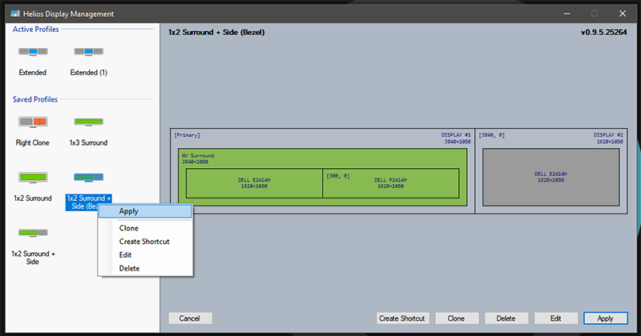
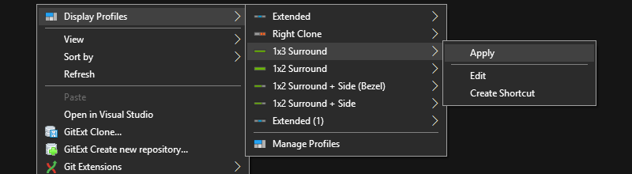
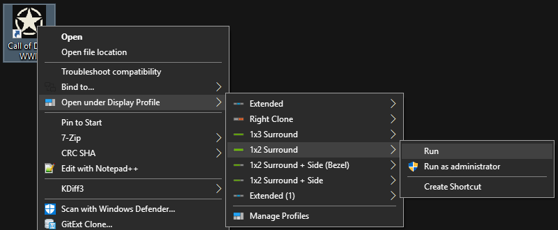

# Helios Display Management
[](https://github.com/falahati/HeliosDisplayManagement/blob/master/LICENSE)
[](https://github.com/falahati/HeliosDisplayManagement/commits/master)
[](https://github.com/falahati/HeliosDisplayManagement/issues)

An open source tool for display profile management. Readily switch between display profiles & settings.

**This program is still in development and currently in the pre-release stage; expect missing features, incomplete features and bugs**

<div style="text-align:center"></div>

## Download
[](https://github.com/falahati/HeliosDisplayManagement/releases)
[](https://github.com/falahati/HeliosDisplayManagement/releases)

The latest version of this application is available for download via the [release](https://github.com/falahati/HeliosDisplayManagement/releases) page.

## Donation
Donations assist development and are greatly appreciated; also always remember that [every coffee counts!](https://media.makeameme.org/created/one-simply-does-i9k8kx.jpg) :)

[](https://www.paypal.com/cgi-bin/webscr?cmd=_donations&business=WR3KK2B6TYYQ4&item_name=Donation&currency_code=USD&source=url)
[](https://www.coinpayments.net/index.php?cmd=_donate&reset=1&merchant=820707aded07845511b841f9c4c335cd&item_name=Donate&currency=USD&amountf=20.00000000&allow_amount=1&want_shipping=0&allow_extra=1)
[](https://zarinp.al/@falahati)

**--OR--**

You can always donate your time by contributing to the project or by introducing it to others.

## What it does

Provides an overview of saved profiles for easy editing and switching, as well as functions to automatically switch to a selected profile then run a chosen program, including reverting to the previous profile after the executed application has closed. Useful to change resolution, or merge displays into a single desktop for gaming, then return to normal desktop configuration when finished.

Please read through the README for features (current and planned) and issues you may encounter while using the program. 

Feel free to report missing features or bugs using the project [issue tracker](https://github.com/falahati/HeliosDisplayManagement/issues).

## Current features

* Supports saving of an unlimited number of display profiles
* Ability to switch to a display profile via the desktop context menu
* Ability to create a shortcut for a profile for fast and easy switch
* Ability to switch before executing a program or game and reverting back after exiting the program
* Support games with a launcher
* Supports Steam games
* Supports NVIDIA Surround and NVIDIA Mosaic settings

## Planned features

* Edit saved profile via the application's user interface (20% done)
* Create new profile vis the application's user interface (Stalled by the previous task)
* Notification icon while the program waits for a game to exit
* Automatic update check and notifications
* Possibility to install components separately (especially the Shell Extension)
* Support of AMD Eyefinity (Needs a C# wrapper for AMD ADL)
* Save and restore taskbar location (90% done)

## Features to be considered

* Save and restore monitor colour calibration settings (Needs expanding of underlying wrappers)

## Known issues

* Cannot restore custom colour profiles (colour tunings)
* In some circumstances the `Windows Taskbar` may not return to its original location
* Command line cannot parse hyphens in `-a` or `--arguments` options

## Usage

### Initial Setup:

1. Install 'Helios Display Management' and restart your computer
2. Run 'Helios Display Management'
3. Use 'Windows Display Settings' or 'NVIDIA Control Panel' to configure your display(s) as desired
4. Save the current profile in 'Helios Display Management' by selecting the **Active Profile** and using **Clone** button
5. Repeat from step 3 and clone each configuration you want to be able to switch to later


### Switch via Application Window

- Select a from the left panel to save (**Clone**), switch to (**Apply**), **Edit** (currently unsupported), or **Create a Shortcut**

- **Create Shortcut:** Creates a windows shortcut
  - **Temporarily switch with process monitoring:** Give 'Helios Display Management' a program to execute after switching profile, and monitor to keep the profile active until the program is closed, then revert to the last used display profile.  
     - **Monitoring an application**
       - **Executable Address:** Path of executable to run, or browse to select the executable.

       - **Waiting Process:** Keep selected profile active while 'Process' is running. When it is detected that the process has ended 'Helios Display Management' will revert to the previous display profile. This is useful for games that have a separate launcher.

       - **Timeout:** Maximum time (in seconds) to wait for the main process to start after launcher exits. Will revert the display profile automatically if the process was not detected in this time.

        - **Arguments:** Arguments to be passed to the executing application
     - **--OR--**
     - **Monitoring a Steam Game**
        - **Steam Game:** - AppID of Steam Game to launch - enter manually, or select from the auto-detected list of installed Steam games (Can take some time to populate with recent installations as it tries to download the game title and icon from SteamDB).

        - **Timeout:** Maximum time (in seconds) to wait for Steam Game/App to begin. Will revert the display profile automatically if the game fails to start in this time.

        - **Arguments:** Arguments to be passed to the Steam Game

  - Save shortcut in a chosen folder with a chosen name

  
### Switch via Shell Extension
- **Switch to a profile**
   - Right click on your desktop
   - Navigate to 'Display Profiles' menu
   - Select a profile and navigate to the sub-menu
   - **Apply**, **Edit** or **Create Shortcut** for the selected profile

<div style="text-align:center"></div>

- **Temporarily switch to a profile with application monitoring**
   - Right click on an executable file or shortcut (Game, Application, Steam Shortcut)
   - Navigate to 'Open under Display Profile' menu
   - Select a profile and navigate to the sub-menu
   - **Run**, **Run as Administrator** or **Create Shortcut** for the selected profile
   
<div style="text-align:center"></div>

### Switch via Command Line
**Command:**

`HeliosDisplayManagement.exe {arguments}`

**Arguments:**

* `-a [SwitchProfile|CreateShortcut|EditProfile]`, `--action [SwitchProfile|CreateShortcut|EditProfile]`
* `-p "{ProfileID}"`, `--profile "{ProfileID}"`
* Temporary switch
   * Application or Game
      * `-e "{ApplicationPath}"`, `--execute "{ApplicationPath}"` -- (Default: None) -- The path to program executable to be run after switching display profile
      * `--arguments "{ProgramArguments}"` -- (Default: None) -- Arguments to send to the program executable
      * `-w "{ProcessName}"`, `--waitfor "{ProcessName}"` -- (Default: None) -- 'ProcessName' to wait for; will (If different than the executed program, ie if executing a game launcher that would close when the game is run)
      * `-t {TimeoutInSeconds}`, `--timeout {TimeoutInSeconds}` -- (Default: 30) -- Maximum time in seconds to wait for the program to start. Will revert to previous display profile if the program fails to start in this time.
    * Steam Game
      * `-s {SteamAppID}`, `--steam {SteamAppID}` -- (Default: 0) -- AppID of the Steam game
      * `--arguments "{SteamArguments}"` -- (Default: None) -- Arguments to send to Steam (launch options)
      * `-t {TimeoutInSeconds}`, `--timeout {TimeoutInSeconds}` -- (Default: 30) -- Maximum time in seconds to wait for the game to start. Will revert to previous display profile if the game fails to start in this time.

**Example:**

```
"C:\Program Files\Helios Display Management\HeliosDisplayManagement.exe" -a SwitchProfile -p "{00000000-0000-0000-0000-000000000000}" -e "C:\Games\Game Folder\GameExecutable.exe" -w "GameProcessName" --arguments "nosplash" -t 30
```

## Related Projects

- [**WindowsDisplayAPI**](https://github.com/falahati/WindowsDisplayAPI/): WindowsDisplayAPI is a .Net wrapper for Windows Display and Windows CCD APIs

- [**EDIDParser**](https://github.com/falahati/EDIDParser/): EDIDParser is a library allowing all .Net developers to parse and to extract information from raw EDID binary data. (Extended Display Identification Data)

- [**NvAPIWrapper**](https://github.com/falahati/NvAPIWrapper/): NvAPIWrapper is a .Net wrapper for NVIDIA public API, capable of managing all aspects of a display setup using NVIDIA GPUs

## License
Copyright (C) 2019 Soroush Falahati

This program is free software; you can redistribute it and/or modify
it under the terms of the GNU General Public License as published by
the Free Software Foundation; either version 2 of the License, or
(at your option) any later version.

This program is distributed in the hope that it will be useful,
but WITHOUT ANY WARRANTY; without even the implied warranty of
MERCHANTABILITY or FITNESS FOR A PARTICULAR PURPOSE.  See the
GNU General Public License for more details.

You should have received a copy of the GNU General Public License along
with this program; if not, write to the Free Software Foundation, Inc.,
51 Franklin Street, Fifth Floor, Boston, MA 02110-1301 USA.


## Credits
Thanks for the work and the time that all of our contributors put into making this a better project. Following is a short list, containing the name of some of these people:

* Readme file created by @timegrinder
