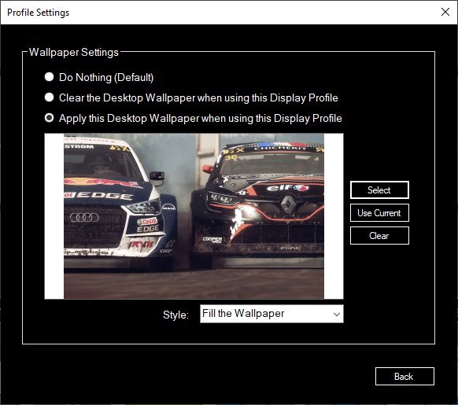
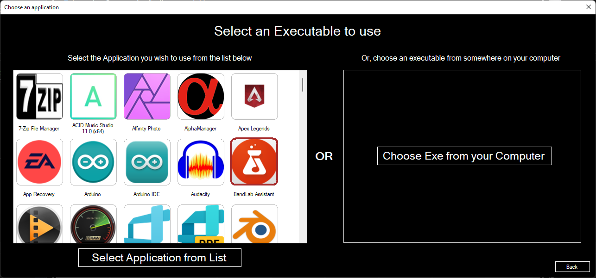
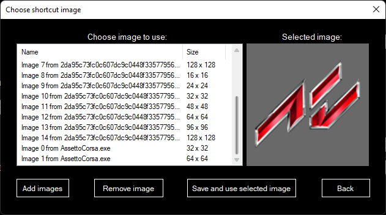
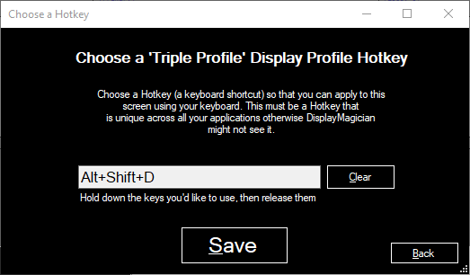
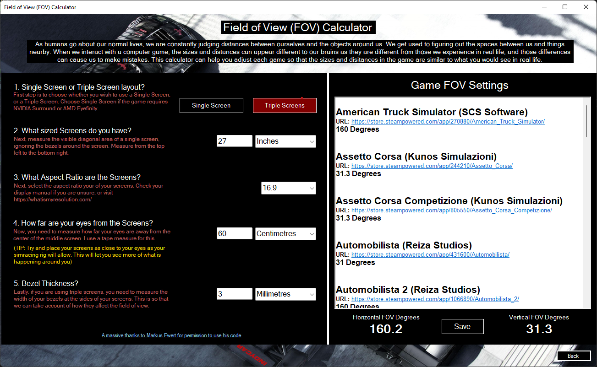
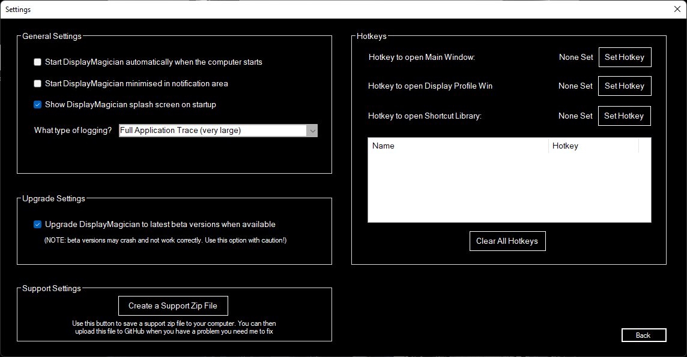
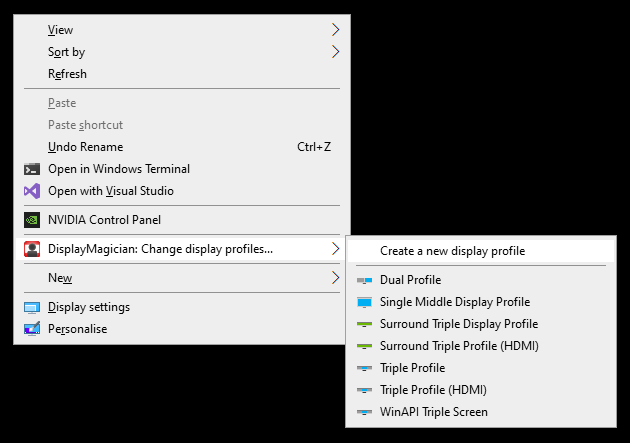

# DisplayMagician

DisplayMagician is an open source tool for automatically configuring your displays and sound for a game or application from a single Windows Shortcut. DisplayMagician is designed to change your display profile, change audio devices, start extra programs and then run the game or application you want. It will even reset things back to the way they were for you once you've closed the game or application!

## Download

The latest version of this application is available for download via the [release](https://github.com/terrymacdonald/DisplayMagician/releases/latest) page.

** IMPORTANT! ** - If you tried DisplayMagician in the past and it didn't work for you, please try it again. There has been a complete rewrite of the NVIDIA, AMD and Windows video manipulation libraries, and it is able to track and manipulate nearly all possible display configuration settings!

## What it does

Different games require your displays configured in different ways. If you're a simracer like me, you also require a lot of additional 'helper' applications the give you the additional functionality to game the way you want. Making all those changes each time I wanted to play each game REALLY started annoying me, and I thought there must be a better way.

There is now. DisplayMagician allows you to configure multiple different display profiles, and then use those different display profiles to create Game Shortcuts. These Game Shortcuts allow you to have your game or application start exactly the way you like it.

Do you like running Dirt Rally 2.0 on a single NVIDIA Surround window across triple screens, and yet you like to run Assetto Corsa across four individual screens (a triple and one above)? Do you like running SimHub when you play iRacing, yet you want to start Twitch when you play Call of Duty? Well with DisplayMagician you can do all that with a single Desktop Shortcut (you can even start games with a Hotkey)!

DisplayMagician also allows you to automatically change to a different audio device just for one game, and will revert that change when you close the game. Great if you have some special audio devices you use only for certain games. No more fiddling with audio settings - just play the game!

Please read through the README for features (current and planned) and issues you may encounter while using the program. 

Feel free to report missing features or bugs using the project [issue tracker](https://github.com/terrymacdonald/DisplayMagician/issues).

## Current features

DisplayMagician lets you set up the following information for each game or application:
* Create and save a Display Profile to be used within future Desktop Shortcuts
* Save a Game Shortcut that will automatically change to a different Display Profile and start your Game when you double-click on it.
* Run your Game Shortcut using a keyboard shortcut (Hotkey).
* Or start your games by right-clicking on the DisplayMagician Notification Tray icon.
* Choose which Audio Device you want the shortcut to use. Like using the wireless headset when driving? This lets you with a single click.
* Add one or more programs to pre-start before your game or application
* Allows you to easily select games from the following Game Launchers:
  * Steam
  * Ubisoft Uplay
  * Origin (Electronic Arts)
  * Epic Games 
  * GOG.com
* Or select your Game from a list of installed Windows applications
* Or even select a specific game executable to run
* Optionally rollback to your previous Display profile once the game or application has closed.
* Or maybe just create a Shortcut that permanently changes to a different Display Profile! The options are endless.
* Also comes with a Shell Extension that allows you to change to a different Display Profile by right-clicking on the desktop background!
* Supports NVIDIA Surround setups, AMD Eyefinity setups and standard Windows multi-desktop views.
* Supports USB display devices, wireless display devices and works with SuperDisplay and Spacedesk (Android Tablets as a display)
* Supports Windows DPI Scaling, rotated screens, setting Refresh Rates and HDR
* Supports cloned displays, extended displays, NVIDIA Surround with additional displays, and nearly anything else you can throw at it!
* It even contains a Field-of-view (FOV) Calculator to help set games to make objects appear at normal size
* Allows you to easily chose installed applications from software installed via installers and UWP apps downloaded from the Microsoft Store.

## Planned features

* Migrate from .Net Framework 4.8 to .Net 7, and transition to new supported libraries
* Create DisplayMagician v3 using MAUI rather than Winforms
* Add Unit Tests!
* Maybe add Intel Alchemist GPU spanned screen support when those cards are eventually released.

## Requirements

* DisplayMagician only supports 64-bit Windows 10 (version 1809 or later) and 64-bit Windows 11
* NVIDIA Surround support requires NVIDIA Game Ready driver to be installed
* AMD Eyefinity support requires AMD Radeon™ Software Adrenalin 2020 Edition 21.2.1 or later to be installed

## Donation
I am doing this work to scratch a programming itch I've had for a while. It's pretty fun to craft something that is useful to so many people. That said, I'd appreciate a donation to help buy a coffee or two! 

## Usage

### Screenshots

### Initial Setup:

If you prefer to see a video on how to setup DisplayMagician, check out [this awesome 'How to Setup DisplayMagician' video from JDM PC Gaming](https://www.youtube.com/watch?v=xqguYAMNHLM). Otherwise, perform the steps shown below:

1. Install 'DisplayMagician'
2. Run 'DisplayMagician', and click on the 'Display Profiles' button
    * Use 'Windows Display Settings', 'NVIDIA Control Panel' or 'AMD Radeon Setup' to configure your display(s) exactly as you would like them
    * ALT-TAB back to DisplayMagician, and you should see the new display configuration shown in the Display Profile window.
    * Click the 'Save As/Rename' button so that DisplayMagician will remember the current Display Profile so you can use it in your Game Shortcuts.
    * You will need to do this for each different display configuration you want to use in any of your games or applications.
    * Click 'Back' button to go back to the main DisplayMagician window.
2. Now that you have some Display Profiles set up, you can create some Game Shortcuts that will use them! Click on the 'Game Shortcuts' button.
3. You will be shown your Shortcut Library window. This is where all your Shortcuts live, and where you have to go if you ever want to edit them.
4. Click the 'New' button to create a new Game Shortcut
    * Choose the Display Profile you want to use with the Game Shortcut. Make sure it matches what the game expects :).
    * Click on the '2. Choose Audio' tab, to modify which speakers you use for sound, or which microphone you use to talk into.
    * Click on the '3. Choose what happens before' tab, to choose any other programs you want to start before you start the main Game or Application. You can choose if you want to shut them down afterwards too! Click on the 'Find Examples' button if you'd like to see some example helper software and their settings for popular games.
    * Click on the '4. Choose Game to start' tab, to choose the main game or application that the Game Shortcut will start and monitor.
    * Choose the Game from the list shown (be sure to click it so it has a red border), or if it's not shown in ths list then select the specific game or application executable in the 'Launch a Game executable' section of the page. 
    * Click on the '5. Chose what happens afterwards' tab, and choose if you want to rollback any changes made by the Game Shortcut when it runs, or if you want to keep them rather than rolling them back.
    * If the 'auto-suggest name' option is enabled then you should have a Shortcut Name already entered in automatically. 
    * You can optionally create a keyboard shortcut (Hotkey) for this Game Shortcut. To do this, click on the 'Hotkey' button.
    * Click the 'Save' button to save the Shortcut to the Shortcut Library. If you can only see the outline of a button, then you have some missing fields you need to fill in. The Save button only shows if you have a valid Shortcut set up.
5. Once you've saved the Short cut, you should see it in the Shortcut Library.
6. To create a Desktop shortcut file from your Shortcut, select it in the list in your Shortcut Library, and click the 'Save to Desktop' button. This will then write the Shortcut to your computer, ready to use!

You now have 4 different ways you can start your shortcut:
* You can double-click on the Desktop shortcut you just saved to the Desktop to start your game; or
* You can right mouse click on the desktop background, and select the Game Shortcut from the DisplayMagician pop-up menu to start your game; or 
* You can right mouse click on the DisplayMagician notification tray icon, and select the Game Shortcut from the DisplayMagician pop-up menu to start your game; or
* (optionally) If you've set a Hotkey for your Game Shortcut, you can press the Hotkey keyboard shortcut whenever DisplayMagician is running and your Game Shortcut will run.

Have fun!

## License

Copyright © Terry MacDonald 2020-2023

Original HelioDisplayManagement - copyright © Soroush Falahati 2017-2020

This program is free software; you can redistribute it and/or modify
it under the terms of the GNU General Public License as published by
the Free Software Foundation; either version 3 of the License, or
(at your option) any later version.

This program is distributed in the hope that it will be useful,
but WITHOUT ANY WARRANTY; without even the implied warranty of
MERCHANTABILITY or FITNESS FOR A PARTICULAR PURPOSE.  See the
GNU General Public License for more details.

You should have received a copy of the GNU General Public License along
with this program; if not, write to the Free Software Foundation, Inc.,
51 Franklin Street, Fifth Floor, Boston, MA 02110-1301 USA.

## Credits
I’m so very thankful for the help of the following people, who make DisplayMagician possible:

* Sean at SimCraft (Thank you so much for your generous donation!)
* Domenic (Thanks for the solid month of troubleshooting help and the monthly sponsorship!)
* Frcooper (thanks for the monthly donations)
* Miiinttt (thanks for the monthly donations)

Also big thanks to:
* Dmanzano1 (Thank you for your donation)
* Yohan (Thank you for your donation)
* Guennid (Thank you for your donation)
* RBZL (thanks for the past monthly donations)
* Davedontmind (Thank you for your donation)
* Hmalatian (Thank you for your donation)
* Nielssoeth (Thank you for your donation)
* Markus Ewert 'dinex86' (Thanks for letting my use your FOV logic)
* Dogy007 (Thanks for the sponsorship)
* Ceramed (Thank you for your donation and your help troubleshooting SuperDisplay and SpaceDesk screens)
* Bjorg (Thank you for your donation)
* MichaelDWheeler (Thank you for your donation)
* Frank (Thank you for your donation)
* Dan Clark (Thank you for your donation)
* Fonzmonster (Thank you for your donation)
* Logozo (Thank you for your donation)
* 5th (Thank you for your donation)
* Patrickdiezi (Thank you for your donation)
* Fifowole (Thank you for your donation)
* Brett Horton (Thank you for your donation)
* Patrickdiezi  (Thank you for your donation)
* NoDepth (For your bug report)
* Chris5gd (For your bug report)
* JabberJon (Thank you for your donation)
* Sikhalv (Thank you for your donation)
* Friedobaer (Thank you for your donation)
* PanthaRhei (Thank you for your donation)
* Matthex (Great help testing multiple display adapter bugs and 7 different screens! And for your donation!)
* NudeNull (Thank you for your sponsorship)
* 20vmki (Thank you for your sponsorship)
* Lazerwolf22 (Thank you for your sponsorship)
* Spmac (Thank you for your sponsorship)
* Mcdbergh (thanks for the bug report)
* JSchoonbrood (Great help testing multiple display adapter bugs and SuperDisplay Android Tablet support)
* Outerspacejunky16 (Thanks for testing AMD support)
* Matthex (Great help testing multiple display adapter bugs and 7 different screens!)
* Dev1981 (Great help testing multiple display adapter bugs and DisplayLink USB)
* Domenic (Thanks for the solid month of troubleshooting help and the sponsorship!)
* Gretzer (thanks for the cool idea)
* Erbkaiser (One of the most impressive testers with an amazing eye for detail)
* SneakingJ (Major props for the help getting cloned display profiles to work)
* Scowling (Again, without you, AMD support wouldn’t exist AT ALL! )
* Slippery-silvia (Again, thanks for the testing help for Mosaic cards with v2.1)
* Mobeeuz (Your thorough testing logs really helped!)
* S4b0tage (Thanks for the testing help and the donation!)
* Gpo123 (thanks for the bug report)
* Whitestar127 (thanks for the bug report)
* Frcooper (thanks for the sponsoring)
* Stringfieldmark (thanks for continued sponsoring and the testing help)
* Bossebossebosse (thanks for the donation)
* Sk666 (thanks for the donation)
* FormelLMS (thanks for the continued sponsoring and the testing help)
* Neilperson (thanks for the cool idea)
* DragRedSim (thanks for the bug report)
* Original HelioDisplayManagement project created by the amazing Soroush Falahati
* Various icons made by Freepik from www.flaticon.com
